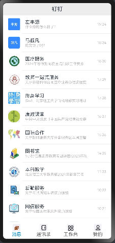
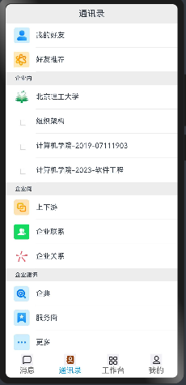
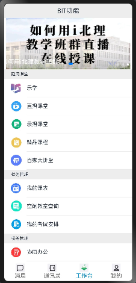
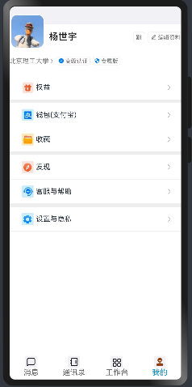

## 钉钉i北理

#### 功能介绍

仿照钉钉i北理的UI，使用鸿蒙原生artks搭建了钉钉i北理的UI

- 首页消息展示，并可以实现下滑
- 通讯录展示，包括企业内、企业间等等
- 工作台部分，包括i北理的基本功能展示，实现了与钉钉相同的动态横滑页面
- 我的部分，展示自己的个人信息，与钉钉相同的权益、钱包等部分
- 底部模块选择部分，在选择模块前与选择模块后会有动态的图片变化

#### 程序截图

